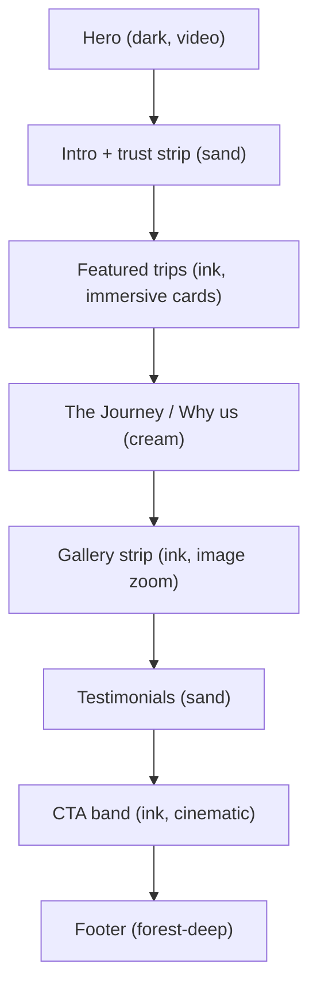

# Himalayan Travel Brand Site — Plan

## 1. Stack & setup

- **Next.js 15 (App Router) + TypeScript + Tailwind CSS v4** — created via `create-next-app` into the empty workspace root.
- Add: `framer-motion` (motion), `lucide-react` (icons), `clsx` + `tailwind-merge` (`cn` util).
- Fonts via `next/font/google`: **Fraunces** (display serif, bold weights) for headings, **Inter** (clean sans) for body — mapped to CSS vars `--font-display` and `--font-sans`.
- Configure `next.config.ts` to allow remote images from `images.pexels.com`, `images.unsplash.com`, `videos.pexels.com`.
- Placeholder brand name **"Altura"** with tagline "Curated Himalayan Escapes" — centralised in `lib/site.ts` so the user can rename in one place. WhatsApp number also lives here.

## 2. Design system (Tailwind config)

Custom tokens in `tailwind.config.ts`:

- **Colors**
  - `sand` `#F4EEE4` (warm off-white body bg)
  - `cream` `#FAF6EF` (alt light bg)
  - `ink` `#12140F` (near-black, cinematic sections)
  - `forest` `#1F3A2E` (deep green accent)
  - `forest-deep` `#14261E`
  - `copper` `#B8552C` (primary CTA)
  - `copper-hover` `#9C4622`
  - `muted` `#6B6A64` (body muted text)
- **Font families**: `font-display` → Fraunces, `font-sans` → Inter.
- Container: centered, `px-6 md:px-10 lg:px-16`, max-w 7xl.
- Shared utilities in `app/globals.css`: `.section`, `.section-dark`, `.eyebrow`, `.cta-primary`, `.cta-ghost`, `.card` (soft rounded-2xl, subtle border, low-elevation shadow).

## 3. Section rhythm (alternating light/dark)

The homepage is designed as a journey, not a grid of boxes:

## 4. Pages & routes

- `app/page.tsx` — Homepage (composes sections below).
- `app/tours/page.tsx` — Tours listing: slim editorial hero, region filter chips (client), responsive grid of `TourCard`.
- `app/tours/[slug]/page.tsx` — Tour detail: image hero, overview + key facts row, day-by-day itinerary (accordion), gallery, included/excluded, sticky inquiry sidebar (form + WhatsApp). Uses `generateStaticParams` from `data/tours.ts`.
- `app/about/page.tsx` — Editorial story page: headline, founder portrait, values pillars, team grid, behind-the-scenes gallery.
- `app/contact/page.tsx` — Calm light layout: form (name, email, trip interest, message), WhatsApp + phone + email blocks, embedded static map image.

## 5. Components

Global (`components/layout/`):
- `Navbar.tsx` — transparent over hero, turns solid sand/ink on scroll (scroll listener), logo wordmark in Fraunces, links, WhatsApp icon CTA.
- `Footer.tsx` — dark `forest-deep`, newsletter input, nav columns, socials, credits.
- `FloatingWhatsApp.tsx` — fixed bottom-right, copper circle with WhatsApp icon, pulse-on-mount only, links to `wa.me/<number>?text=...`.

UI (`components/ui/`):
- `SectionReveal.tsx` — wraps children in a Framer Motion `whileInView` fade-up (20px, 0.6s, once). Used across every section for consistent motion.
- `Button.tsx` — `variant: primary | ghost | dark`, primary is copper, subtle hover (translate-y + slight shadow).
- `cn.ts` util.

Home (`components/home/`):
- `Hero.tsx` — full-viewport `<video autoPlay muted loop playsInline>` with Pexels mountain MP4 URL + poster image, dark gradient overlay (`from-ink/80 via-ink/40 to-ink/90`), display headline, sub, primary + ghost CTAs, scroll indicator.
- `FeaturedTrips.tsx` — 3 immersive full-bleed cards (image-first, ink bg), title overlay, price-from, duration.
- `Journey.tsx` — 3 pillars (Small groups · Curated routes · Local-led), editorial 2-col.
- `Gallery.tsx` — asymmetric masonry of 6–8 images, `group-hover:scale-105 transition-transform duration-700` on images inside `overflow-hidden rounded-2xl`.
- `Testimonials.tsx` — 2–3 soft cards, short quote, guest name + trip.
- `CtaBand.tsx` — cinematic ink section with background image + overlay, big headline, primary CTA to `/contact`.

Tours (`components/tours/`):
- `TourCard.tsx` — image-first, rounded-2xl, subtle border, image zoom on hover, meta row (region · days · from ₹).
- `TourHero.tsx`, `Itinerary.tsx` (accordion), `InquirySidebar.tsx` (sticky, includes WhatsApp deep-link with pre-filled tour name).

## 6. Data

- `data/tours.ts` — typed `Tour[]` with 6 sample trips (Ladakh · Spiti · Kashmir · Manali-Leh · Kedarkantha · Valley of Flowers): `slug`, `title`, `region`, `days`, `priceFrom`, `difficulty`, `bestSeason`, `heroImage`, `gallery[]`, `overview`, `itinerary[]`, `included[]`, `excluded[]`.
- `data/testimonials.ts` — 3 entries.
- All image/video URLs point to Pexels/Unsplash — easy to swap later.

## 7. Motion rules (kept restrained)

- Sections fade-up on enter (`SectionReveal`) — single shared pattern, no variance.
- Cards: image `scale-105` + slight `translate-y` lift on hover, 600–700ms.
- CTAs: background color + `translate-y-[1px]` on hover.
- Hero video: silent loop, no parallax, no flashy effects.

## 8. Mobile-first conversion

- Hero CTA sits above the fold with generous tap targets (min 48px).
- `FloatingWhatsApp` visible on every page, every breakpoint.
- Tour detail inquiry sidebar collapses to a sticky bottom bar on mobile ("Inquire · WhatsApp").
- Form inputs use large type, `rounded-xl`, visible focus ring in copper.

## 9. Files to be created (high level)

- `app/layout.tsx`, `app/globals.css`, `app/page.tsx`, `app/tours/page.tsx`, `app/tours/[slug]/page.tsx`, `app/about/page.tsx`, `app/contact/page.tsx`
- `components/layout/{Navbar,Footer,FloatingWhatsApp}.tsx`
- `components/ui/{SectionReveal,Button,cn}.tsx`
- `components/home/{Hero,FeaturedTrips,Journey,Gallery,Testimonials,CtaBand}.tsx`
- `components/tours/{TourCard,TourHero,Itinerary,InquirySidebar}.tsx`
- `data/{tours,testimonials}.ts`
- `lib/site.ts`
- `tailwind.config.ts`, `next.config.ts`, `package.json`, `tsconfig.json`, `README.md`

## 10. Out of scope for this pass

- Real booking/payment flow, CMS, blog, i18n, analytics.
- Custom-shot video/photography (using Pexels/Unsplash placeholders that can be swapped later).
