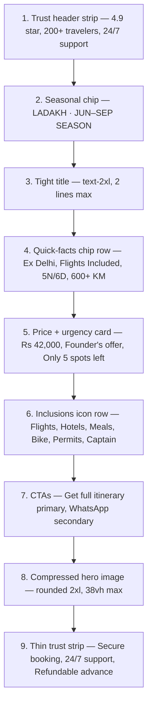

## Goal

Make the first mobile screen of `/tours/[slug]` function as a conversion card for Meta-ads traffic while preserving the premium / cinematic feel. Desktop hero stays in its current two-column premium layout, only lightly tightened.

## Files touched

- [data/tours.ts](data/tours.ts) — extend `Tour` type with optional trust + urgency fields, seed on Ladakh tour.
- [components/tours/landing/landing-helpers.ts](components/tours/landing/landing-helpers.ts) — add helpers to derive inclusion icons, urgency line, header trust items, quick-fact chips.
- [components/tours/landing/LandingHero.tsx](components/tours/landing/LandingHero.tsx) — rebuild as two distinct layouts in one component: a stacked mobile conversion card (`<lg`) and a slightly tightened version of the existing desktop hero (`lg+`).
- [app/tours/[slug]/page.tsx](app/tours/[slug]/page.tsx) — no structural change; the existing `pt-16` and the order of sections stay the same. Possibly reduce wrapper padding adjustments handled inside `LandingHero`.

No changes to `OfferStrip`, `QuickFacts`, `TourHighlights`, `Navbar`, `StickyMobileCTA`, or any below-the-fold section.

---

## 1. Data layer — extend `Tour` ([data/tours.ts](data/tours.ts))

Add optional fields used by the new conversion card. All optional; render only when present.

```ts
export type Tour = {
  // ...existing fields
  rating?: number;          // e.g. 4.9
  reviewCount?: number;     // e.g. 200
  nextBatchDate?: string;   // e.g. "15 Jun"
  spotsLeft?: number;       // e.g. 5
};
```

Seed on the Ladakh tour (the page currently demoed):

```ts
rating: 4.9,
reviewCount: 200,
nextBatchDate: "15 Jun",
spotsLeft: 5,
```

No changes required for other tours — fields are optional and the component gracefully omits the line when missing.

---

## 2. Helpers ([components/tours/landing/landing-helpers.ts](components/tours/landing/landing-helpers.ts))

Add four small helpers next to the existing `getHeroTrustChips`:

- `getQuickFactChips(tour): string[]` — top 4 from `tour.trustChips` (Ex Delhi, Flights Included, 5N/6D, 600+ KM Circuit).
- `getUrgencyLine(tour): string | null` — priority order: `spotsLeft` → "Only N spots left" → `nextBatchDate` → "Next batch · 15 Jun" → `offer.filling` (existing copy).
- `getInclusionIcons(tour)` — return an array of `{ icon, label }` derived from existing data:
  - `Plane` "Flights" if `quickFacts.flightsIncluded`
  - `BedDouble` "Hotels" if `quickFacts.stayType`
  - `UtensilsCrossed` "Meals" if `quickFacts.mealPlan`
  - `Bike` "Bike" if `quickFacts.bikeType` (or `Bus` / `Car` for non-bike trips later)
  - `Ticket` "Permits" if `tour.included` contains "permit"
  - `UserCheck` "Captain" if `tour.included` contains "captain"
- `getHeaderTrustItems(tour)` — returns `["4.9 ★", "200+ travelers", "24/7 support"]` style array, but only the ones we have data for, plus the static "24/7 support" item.

---

## 3. `LandingHero` rebuild ([components/tours/landing/LandingHero.tsx](components/tours/landing/LandingHero.tsx))

Split the component into two parallel render blocks toggled by responsive utilities:

- `<div className="lg:hidden">…mobile conversion card…</div>`
- `<div className="hidden lg:block">…desktop premium hero…</div>`

### 3a. Mobile (`<lg`) — light, dense, premium card stack

Background: light (`bg-sand`) so it visually inverts into the dark `OfferStrip` below — gives a natural rhythm and lets the hero image read as a discrete cinematic block, not page wallpaper.

Order (matches the requested first-fold order):



Key constraints:

- Section uses `pt-3 pb-6` (vs current `pt-24 pb-16`) to claw back vertical space below the fixed navbar.
- Title clamps to `text-2xl leading-[1.15]` (currently `text-3xl sm:text-5xl`).
- Inclusions icon row is a horizontal-scroll `overflow-x-auto flex` with 6 chips of `~64px` width — fits 4 visible + scroll affordance.
- Price card is a single `soft-panel` row with `Rs 42,000 / per person` on the left and a `Founder's offer` pill + urgency line on the right.
- Urgency line uses `Flame` or `Clock` icon + copper accent; uses `getUrgencyLine`.
- CTAs: full-width stacked `Get full itinerary` (primary copper) and `Chat on WhatsApp` (ghost with border).
- Compressed hero is a separate `<div className="relative h-[38vh] max-h-[300px] overflow-hidden rounded-2xl">…<Image fill/>…</div>` with a subtle bottom gradient and one floating chip (e.g. "Pangong cottage · star gazing").
- Bottom trust strip is a thin row of 3 micro chips: `Secure booking`, `24/7 support`, `Refundable advance` — only rendered if there's still vertical room (always show, it's tiny).

Approximate vertical budget targeted (~700px first fold under 68px navbar):

- trust header 28 + chip 28 + title 70 + facts 40 + price card 96 + inclusions 64 + CTAs 96 + hero 280 + trust strip 32 ≈ 734px. Tight on small phones (iPhone SE ~ 568px usable), so on `max-h < 700` the hero will naturally slide just below the fold — acceptable because CTAs are already above it.

### 3b. Desktop (`lg+`) — keep current premium hero, lightly tightened

- Reduce `min-h-[88vh]` → `lg:min-h-[78vh]` and `pt-28` → `lg:pt-20`.
- Reuse the existing two-column grid; the right-side `soft-panel` price card gains:
  - the urgency line from `getUrgencyLine(tour)` directly under the price
  - the inclusion icon row (same helper) shown as small icons inside the panel
- Headline + sub copy unchanged.

This keeps the cinematic dark hero intact on desktop while making the price card more action-oriented.

---

## 4. Visual / token notes

- All new chips use existing tokens: `border-black/10 bg-cream` (light) and `border-sand/15 bg-white/5 backdrop-blur-sm` (dark) — keeps the established premium look.
- Copper accents (`bg-copper`, `text-copper`) only on the primary CTA and the urgency icon — preserves restraint.
- No new fonts, no new colors.

---

## 5. Out of scope (explicit)

- No changes to `OfferStrip`, `QuickFacts`, `TourHighlights`, or any section below the first fold.
- No new tracking / analytics wiring.
- No copy changes outside the hero.
- Other tours without the new optional fields render identically to today (graceful degradation).