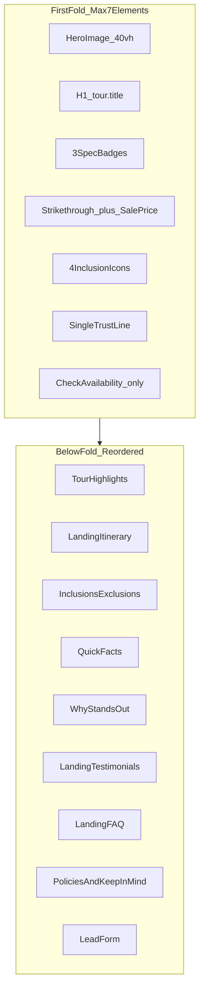

# Simplified Meta Ads First Fold

## Problem

The current mobile hero in [`LandingHero.tsx`](components/tours/landing/LandingHero.tsx) stacks **9 blocks** before the image (trust header, season chip, poetic `hookLine`, route, 4 quick-fact chips, price card, 6 inclusion icons, dual CTAs, bottom trust chips). Immediately after, [`page.tsx`](app/tours/[slug]/page.tsx) renders [`OfferStrip`](components/tours/landing/OfferStrip.tsx) (4 cards) and [`QuickFacts`](components/tours/landing/QuickFacts.tsx) (6 image cards)—so users see **15+ competing elements** before meaningful scroll.

The new brief inverts the prior approach: **fewer elements, hero-first, price-dominant, one CTA**.



---

## 1. Data layer — [`data/tours.ts`](data/tours.ts)

Add optional pricing + fold copy fields (graceful when absent):

```ts
export type TourPricing = {
  listPrice: number;       // strikethrough, e.g. 42000
  salePrice: number;       // hero price, e.g. 35999
  urgencyLine?: string;    // "Save ₹6,000 • Limited May slots"
};

export type Tour = {
  // ...existing
  pricing?: TourPricing;
  /** Max 3 short badges for first fold, e.g. "Flights Included" */
  foldBadges?: string[];
  /** Optional override for fold trust line parts */
  ridersCount?: number;    // e.g. 500 → "500+ Happy Riders"
  verifiedLabel?: string;  // e.g. "Verified Operator"
};
```

**Ladakh seed** (per brief):

| Field | Value |
|-------|-------|
| `pricing.listPrice` | `42000` |
| `pricing.salePrice` | `35999` |
| `pricing.urgencyLine` | `Save ₹6,000 • Limited May slots` |
| `foldBadges` | `["Flights Included", "Royal Enfield", "24/7 Support"]` |
| `ridersCount` | `500` |
| `rating` | `4.8` |
| `reviewCount` | `120` |
| `verifiedLabel` | `Verified Operator` |

Remove reliance on `hookLine` in the fold (keep field in data for SEO/meta; hero uses `tour.title` only).

Tours without `pricing` fall back to `priceFrom` as the sole price (no strikethrough).

---

## 2. Helpers — [`landing-helpers.ts`](components/tours/landing/landing-helpers.ts)

Add/replace fold-specific helpers; keep existing builders used elsewhere.

| Helper | Behavior |
|--------|----------|
| `getFoldTitle(tour)` | Always `tour.title` (never `hookLine`) |
| `getFoldBadges(tour)` | `foldBadges` slice(0,3), else derive: flights + bike short label + `"24/7 Support"` |
| `getPricingDisplay(tour)` | Returns `{ listPrice?, salePrice, savingsText?, perPerson: true }` from `pricing` or `{ salePrice: priceFrom }` |
| `getFoldInclusions(tour)` | **Exactly 4** items: Flights, Royal Enfield (short), Hotels (5N), 24/7 Support — mapped from `quickFacts` / `included` |
| `getFoldTrustLine(tour)` | `"500+ Happy Riders • 4.8★ (120 reviews) • Verified Operator"` built from `ridersCount`, `rating`, `reviewCount`, `verifiedLabel` |

Deprecate use of `getHeaderTrustItems`, `getQuickFactChips`, and 6-icon `getInclusionIcons` **inside the fold only** (helpers can remain for desktop card if needed).

---

## 3. Rebuild mobile first fold — [`LandingHero.tsx`](components/tours/landing/LandingHero.tsx)

Replace the `lg:hidden` block with this **exact order** (max ~7 visual groups):

1. **Hero image** — full-width, `h-[40vh] max-h-[320px]`, `priority`, bottom gradient only (no floating chip, no season chip).
2. **H1** — `tour.title`, `text-xl font-display`, 1–2 lines, `px-4`.
3. **Spec badges** — single horizontal row, 3 chips max, subtle `text-xs` pills (not 4 quick-fact cards).
4. **Price block** — largest typography in fold:
   - Strikethrough `listPrice` (muted)
   - Bold `salePrice` + `/person` (copper or ink, `text-3xl+`)
   - Green/copper savings + `urgencyLine` one line below
5. **4 inclusion icons** — fixed grid `grid-cols-4`, icon + one-line label, no horizontal scroll, no borders on each cell (lighter than current cards).
6. **Trust line** — one centered `text-xs` line from `getFoldTrustLine`.
7. **Primary CTA only** — full-width `cta-primary min-h-11`: **"Check Availability →"** → `#lead-form`.

**Remove from mobile fold:**
- Top trust header, season chip, `hookLine`, route/subtitle, 4+ quick-fact chips, Founder’s badge row, 6-icon scroll row, WhatsApp button, compressed hero at bottom, secure-booking micro-chips.

**Spacing:** `pt-0 pb-5 px-4`, tight `gap-3` between blocks; generous whitespace *between* groups, not *inside* them.

---

## 4. Desktop hero — same hierarchy, cinematic shell

Tighten the `lg:block` section to match the simplified story (not the old dual-CTA + poetic headline):

- Keep full-bleed background image + dark gradient.
- Left: `title`, 3 badges, price block (same component as mobile).
- Right: 4 inclusion icons + single **Check Availability** CTA (remove secondary WhatsApp and duplicate “Get full itinerary” in panel).
- Drop `hookLine`, subtitle paragraph, 4 trust chips, and long panel description from the fold.

Target `min-h-[72vh]` (down from `78vh`).

Extract shared subcomponents in the same file to avoid duplication:

- `FoldPriceBlock`
- `FoldInclusionGrid` (4 cols)
- `FoldSpecBadges`

---

## 5. Page composition — [`app/tours/[slug]/page.tsx`](app/tours/[slug]/page.tsx)

**New section order** (everything after hero is below the fold):

```tsx
<LandingHero tour={tour} />
<TourHighlights tour={tour} />
<LandingItinerary tour={tour} />
<InclusionsExclusions tour={tour} />
<QuickFacts tour={tour} />           {/* moved down — “at a glance” / bikes & stays */}
<WhyStandsOut tour={tour} />
<LandingTestimonials />
<LandingCtaBand tour={tour} variant="full" ... />  {/* keep ONE mid-page CTA */}
<PoliciesAndKeepInMind tour={tour} />
<LandingFAQ tour={tour} />
<LeadForm tour={tour} />
<StickyMobileCTA tour={tour} />
```

**Remove from page:**
- [`OfferStrip`](components/tours/landing/OfferStrip.tsx) — redundant with hero price/urgency (component file stays; just unmount on page).
- Second [`LandingCtaBand`](components/tours/landing/LandingCtaBand.tsx) `whatsappOnly` band — reduces CTA competition.
- [`FloatingBadgeRail`](components/tours/landing/FloatingBadgeRail.tsx) on tour pages — desktop distraction; unmount on page.

No copy changes inside `InclusionsExclusions`, `QuickFacts`, FAQ, or policies bodies—only position.

---

## 6. Sticky mobile CTA — [`StickyMobileCTA.tsx`](components/tours/landing/StickyMobileCTA.tsx)

Align with single-goal fold:

- **One** full-width button: `Check Availability →` → `#lead-form`
- Remove dual WhatsApp + itinerary split
- Optional: show tiny sale price left of button (only if `pricing` exists)—skip if it crowds the bar

[`FloatingWhatsApp`](components/layout/FloatingWhatsApp.tsx) already hidden on `/tours/[slug]` — no change.

---

## 7. Visual / performance notes

- Use existing tokens (`copper`, `sand`, `cream`, `cta-primary`); savings line can use `text-forest` or copper—no new palette.
- Hero `Image`: keep `priority`; ensure `sizes="100vw"`.
- No `SectionReveal` / framer in the fold (faster paint).
- `TourHighlights` YouTube iframe stays below fold (already lazy by position).

---

## 8. Out of scope

- Rewriting section copy (“What you’re booking”, FAQ answers, etc.)
- Date picker in first fold (skipped per brief)
- Countdown timer (unless `pricing.urgencyLine` is static copy)
- Image WebP conversion / build pipeline changes
- Changes to `LeadForm` fields (CTA still anchors to `#lead-form`)

---

## 9. Verification checklist

- iPhone SE (375px): price + CTA visible without scroll; no horizontal scroll
- Ladakh page: strikethrough ₹42,000, sale ₹35,999, single CTA
- Other tours without `pricing`: single price, no strikethrough, fold still renders
- Below fold: Highlights → Itinerary → Inclusions → QuickFacts (not immediately after hero)
- Build + lint pass on touched files
